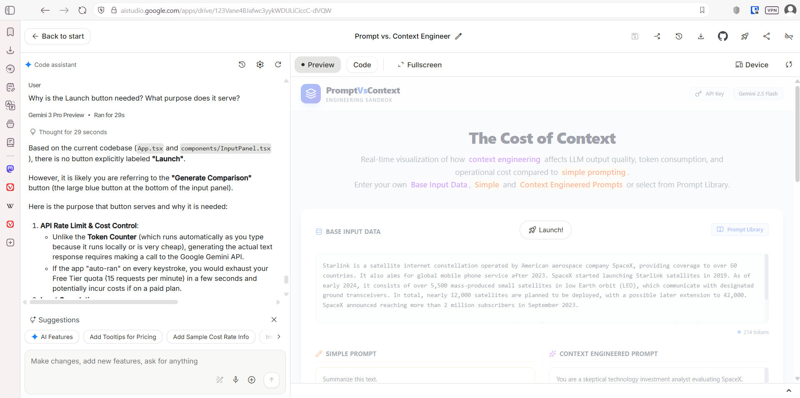

# Prompt vs. Context Engineer



> **Note:** Please add a screenshot of the application named `screenshot.png` to the root of the repository to display the banner above.

A comparative tool to visualize the impact of prompt engineering versus context-rich instructions on LLM outputs, token usage, and operational costs.

## Overview

This application serves as a sandbox for Prompt Engineering. It demonstrates "The Cost of Context" by allowing users to run a **Simple Prompt** and a **Context Engineered Prompt** side-by-side against the same **Base Input Data**.

It visualizes:
*   **Output Quality**: Compare the resulting text from the LLM.
*   **Token Consumption**: Breakdown of Base Input, Prompt, and Output tokens.
*   **Latency**: Execution time for each request.
*   **Cost**: Estimated cost based on Gemini 2.5 Flash pricing.

## Features

*   **Real-time Token Counting**: Estimates token usage as you type.
*   **Cost Analysis**: Calculates estimated input and output costs.
*   **Prompt Library**: Includes pre-loaded scenarios (Logic, Finance, Medicine, etc.) to demonstrate the difference between simple and context-rich prompting.
*   **Gemini 2.5 Flash**: Powered by Google's efficient Gemini 2.5 Flash model.

## Getting Started

### Prerequisites

*   Node.js (v18 or higher recommended)
*   npm or yarn
*   A valid [Google Gemini API Key](https://aistudio.google.com/app/apikey).

### Installation

1.  Clone the repository:
    ```bash
    git clone https://github.com/mugdhav/context_eng_cost_analyzer.git
    cd context_eng_cost_analyzer
    ```

2.  Install dependencies:
    ```bash
    npm install
    ```

### Running the App

Start the development server:

```bash
npm start
# or depending on your build tool (e.g., Vite)
npm run dev
```

Open your browser and navigate to the local server address (usually `http://localhost:3000` or `http://localhost:5173`).

## Usage

1.  **Set API Key**: Click the **Set API Key** button in the top right corner and paste your Google Gemini API Key. The key is stored locally in your browser.
2.  **Enter Data**:
    *   **Base Input Data**: The context, article, code, or data you want the LLM to process.
    *   **Simple Prompt**: A short, zero-shot instruction (e.g., "Summarize this").
    *   **Context Prompt**: A detailed, role-based instruction with constraints and formatting requirements.
3.  **Run Comparison**: Click **Generate Comparison** to see the results side-by-side.
4.  **Analyze**: Review the difference in response quality, total token count, and cost.

## Technologies

*   React 19
*   TypeScript
*   Tailwind CSS
*   Google GenAI SDK
*   Lucide React (Icons)

## License

MIT
